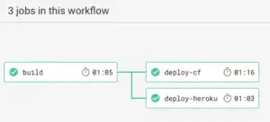

CircleCI is a premier SaaS solution for integrating Continuous Integration pipelines with any any GitHub repositories.  The documentation is loaded with example integrations including Heroku and Cloud Foundry, but for Cloud Foundry are limited to simple `cf push`.  This blog posts explores the full configuration required to enable **Zero Downtime deployments** with the [Blue/Green pattern](https://martinfowler.com/bliki/BlueGreenDeployment.html). The concept of a **Blue/Green deployment** is relatively simple, so long as you're building stateless web apps or services. And that's a well covered topic elsewhere.  This post assumes your apps are stateless, and can run multiple versions in parallel.

### TL;DR
CircleCI now encapsulates several common Cloud Foundry commands in via CircleCI Orbs.  Alternately you can use the CF ClI and script it directly.

#### Use CircleCI Cloud Foundry Orb

See [CircleCI Orb Registry](https://circleci.com/orbs/registry/orb/circleci/cloudfoundry#usage-blue_green_deploy) for more examples.

version: 2.1
orbs:
  cloudfoundry: circleci/cloudfoundry@1.0
workflows:
  deploy:
    jobs:
      - cloudfoundry/blue_green:
          appname: your-app
          domain: your-domain
          org: your-org
          space: your-space


#### Script it yourself

# Push as "dark" instance
cf push my-app-dark -f cf-dev-manifest.yml -p standalone-app.jar -n my-app-dark
# Verify new version is working on dark URL.
HTTPCODE=\`curl -s -o /dev/null -w "%{http_code}" https://my-app-dark.cfapps.io/\`
if \[ "$HTTPCODE" -ne 200 \];then
  echo "dark route note available, failing deploy"
  exit 1
fi
# Send "real" url to new version
cf map-route my-app-dark cfapps.io -n my-app-live
# Stop sending traffic to previous version
cf unmap-route my-app-live cfapps.io -n my-app-live
# stop previous version
cf stop my-app-live
# delete previous version
cf delete my-app-live -f
# Switch name of "dark" version to claim correct name
cf rename my-app-dark my-app-live     
 

### Cloud Foundry Hosting

I signed up for Pivotal Web Services' free trial for my efforts, but you can apply this approach to any Cloud Foundry deployment since we depend solely on the `cf` CLI.  You'll need 4 things from provider of choice:

*   Username
*   Password
*   Org Name
*   Space name

 

### CircleCI Setup - UI

Follow [CircleCI's Getting Started guide](https://circleci.com/docs/2.0/getting-started/), this post does not cover the build & testing of applications, but assumes you have a deployable artifact ready to go.  You can check out my [sample Circle CI project](https://github.com/eddiewebb/circleci-challenge) for an example.  Once your project is visible in the UI, you'll need to add the CF Username and Password. Click the gear icon next to your project name, and then "Environment Variables"  Their add credentials as `CF_USERNAME` and `CF_PASSWORD`

### CircleCI Setup - Manifest

Now that we have a cloud foundry target, and a CircleCI pipeline, let's get into the fun. Creating a `.circleci/config.yml` for **blue green cloud foundry deployments**.  The specific commands led into this article and are repeated below, but accomplish the following steps:

1.  Deploy latest version of the application on a "dark" url. This is a URL not used by our users, but available for testing/validation.
2.  Verify health of new version using smoke testing, healthchecks, etc as appropriate for your use case
3.  Begin sending traffic for your live URL to new version. At this point both your old and new version are serving users side by side, no interruption.
4.  Stop routing traffic to the old version. Since the URL is already load balancing to the new app as well, there is no impact to users here.
5.  Shutdown and remove old application version.
6.  Rename "dark" application to "live" application for subsequent deploys to start back at #1

#### Installing CF CLI on CircleCI images

This is copy/paste from CircleCI's own docs. You could also publish your own docker image if preferred.

curl -v -L -o cf-cli_amd64.deb 'https://cli.run.pivotal.io/stable?release=debian64&source=github'
sudo dpkg -i cf-cli_amd64.deb
cf -v
cf api https://api.run.pivotal.io
cf auth $CF\_USER $CF\_PASSWORD . # **
cf target -o ORG\_NAME -s SPACE\_NAME

\*\* yeah, I know passing credentials on the command line is daft, but CF CLI does not yet seem to support any tokens. If folks now other ways please leave a comment!

#### Executing Deployment Steps

\# Push as "dark" instance
cf push my-app-dark -f cf-dev-manifest.yml -p standalone-app.jar -n my-app-dark
\# Verify new version is working on dark URL.
HTTPCODE=\`curl -s -o /dev/null -w "%{http_code}" https://my-app-dark.cfapps.io/\`
if \[ "$HTTPCODE" -ne 200 \];then
  echo "dark route note available, failing deploy"
  exit 1
fi
\# Send "real" url to new version
cf map-route my-app-dark cfapps.io -n my-app-live
\# Stop sending traffic to previous version
cf unmap-route my-app-live cfapps.io -n my-app-live
\# stop previous version
cf stop my-app-live
\# delete previous version
cf delete my-app-live -f
\# Switch name of "dark" version to claim correct name
cf rename my-app-dark my-app-live     

### Example

Sure! You can view my [sample project in Github](https://github.com/eddiewebb/circleci-challenge) and the corresponding [workflow in Circle CI](https://circleci.com/gh/eddiewebb/workflows/circleci-challenge). 
