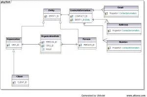

I've had the recent pleasure/pain of implementing JPA  a new Java web application. After reading many misleading blog posts and dead-end mailing list threads I have worked out the major kinks, and thought I would share. A few things first:

*   This not using Hibernate API, or the Hibernate implementation of Java Persistence API
*   The project runs on Websphere 6.1 (WAS6.1), using OpenJPA implemenation of JPA 1
*   Although our application is new, the data model is fixed as it must align with the enterprises larger customer focused data model.
*   I'm not saying anything contained herein is correct, but it works.

Topics

*   Multi-Level Inheritance with different Primary Key columns (id, org id, client id)
*   Custom Inheritance discriminators
*   Stateful Join Tables (ManyToMany relationship with additional payload in the associative table)
*   Boolean to Char mapping (code sees true/false, DB sees Y/N)
*   Managed Id's

Introduction
------------

So first, our data model.  Since our model is pretty well fixed, I had to design the business model around that partially, and partially to the true business needs. [caption id="attachment_840" align="aligncenter" width="300" caption="Notice the CLient, element, which inherets from two levels of parents, and the ROLE field in the join table "][/caption] JPA supports inheritance with release 1, and despite some misleading posts in the internet, it is perfectly capable of overriding PK fields on concrete classes. A class may also inherit from one table, persist to another, and still be inherited from. For instance, a client which has an ID, Name, and Contact Number (among other things) will need to select from the Client table, the Org table, the Entity table, and Contact tables to get all relevant fields.

Inheritance is Endless
----------------------

You're parents were not abstract, and you're likely to have children. What I am saying is that sometime you may need to inherit a few nested classes or levels for a heavily normalized DB. In my case we have a generic ENTITY that can be a person, place or thing.  Below that are Persons and Organizations that inherit contact info, but hold unique fields (first name vs. Tax ID).  Organizations may be further considered Clients, Vendors or Associations. They in turn inherit all contact info, the tax ID, and such, but add additional attributes. Each table does not have a generic ID column. Instead we have several, i.e. ENTITY_ID, ORGANIZATION_ID, and CLIENT_ID. Further more each table uses discriminators of different names and types.  So while the ENTITY tables uses a 2 character code (ENTITY_TYPE_CD (CHAR(2)), the Organization Table uses a 10 character string (ORG_TYPE(CHAR(10)), etc. The solution looks like this; (the 3 classes for client, org, entity)

@Entity
@Table(name="ENTITY")
@Inheritance(strategy=JOINED)
@DiscriminatorColumn(name="ENTITY_TYPE_CD")
public class AbstractEntity{

@Id
@Column(name="ENTITY_ID")//wont work for children, need ot be overridden
private long key; // this is the only class in this tree to have an id field
...
}

@Entity
@Table(name="ORGANIZATION")
//handle relationship to parent
@DiscriminatorValue(value=ENTITY_TYPE_CD_ORG) //string for type "organization" as appose to "person"
@PrimaryKeyJoinColumn(name="ORGANIZATION_ID") // override PK id for this table, no id field needed in class
//define inheritance for children
@Inheritance(strategy=JOINED)//we could use a different type..
@DiscriminatorColumn(name="ENTITY_TYPE_CD") // new discrimoianbtor column
public class Organization extends AbstractEntity{

// look NO id field or @id annotation, just the additional fields in this table
@Column(name="ORG_NAME")
private String organizationName;
...
}

@Entity
@Table(name="CLIENT")
//handle relationship to parent
@DiscriminatorValue(value=ORG_TYPE_CLIENT) //string for type "client" (not assc, or vendor)
@PrimaryKeyJoinColumn(name="CLIENT_ID") // override PK id for this table, no id field needed in class
public class Client extends Organization{

// look NO id field or @id annotation, just the additional fields in this table
@Column(name="CLIENT_ACCT_NO")
private String clientAccountNumber; // not PK or Id, just a random string that relates to client table
...
}

**Continue to page 2 for more on persisting this model.**

Persisting across tables
------------------------

The JPA annotations make the mapping pretty easy once you know the right combinations, and you get em.find(Class, id); for free that will pull back more or less depending how you setup your fetch attributes. But there is still the very tricky matter of persisting this bear of an object model. For my example I illustrate the extra joy of assigning a unique id generated by a service. This means every implemented object in the map gets assigned a key before we save. To try and keep some sanity I divided tasks among the responsible objects.

*   A JSF managed bean ask will ask the 1..n unrelated objects to relate themselves
*   The JSF managed bean then sends the primary and and any associative objects returned by the last step back to the service layer
*   The service layer will then handle persisting all entities in the correct order to meet strict PK/FK constraints on the DB2 database after assigning ids

#### ClientManager.java

The JSF Managed Bean

public class ClientManager{
	
	@ManagedProperty //inject clientService implemention
	private clientService;
	
	//page variables(used by add/edit/view pages)
	private Client client; //client name, acct #, etc
	private Person person; // person name, office
	private Address address; // street1,2,3 city, state, nh,etc
	
	
	public String saveNewClientAction(){
		
		//owning side of stateful joins provide custom methods that return the joining entity (shown in Organization.java - which is inherited by the client!)
		OrgRole or = client.addPersonAsEmployee(person); //you can do custom relationships for each type
		
		//method level variables that will  remain with primary entities lifecycle (not request or session scope)
		AddressType at = person.addAddress(address, AddressType.TYPE_PRIMARY); // or just pass the relationship type to a single method
			
		//now pass our 3 main objeects/entities, and the 2 join entities	
		clientService.create(client, person, address, or, at);
		
		
	
	}

}

#### Organization.java

@Entity
@Table(name="ORGANIZATION")
//handle relationship to parent
@DiscriminatorValue(value=ORG_TYPE_CLIENT) //string for type "client" (not assc, or vendor)
@PrimaryKeyJoinColumn(name="CLIENT_ID") // override PK id for this table, no id field needed in class
public class Organization extends Entity{

	// look NO id field or @id annotation, just the additional fields in this table
	@Column(name="ORG_NAME")
	private String organizationName;
	
	@OneToMany(mappedBy="organization")
	private List organizationRoles = new ArrayList();
	
	
	public OrgRole addPersonAsEmployee(Person person){
		OrgRole or = new OrgRole();
		
		//set the new join objects referneces to both sides.
		or.setPerson(person);
		or.setParty(this);
		
		//add the join object to org list 
		organizationRoles.add(or);
		
		//and ask person to do the same
		person.getOrganizationRoles().add(or);
		
	
	}

} 

#### Person.java

@Entity
@Table(name="PERSON")
//handle relationship to parent
@DiscriminatorValue(value=PARTY_TYPE_PERSON) //string for type "person" (not "organization")
@PrimaryKeyJoinColumn(name="PERSON_ID") // override PK id for this table, no id field needed in class
public Class Person{

	//any person fields
	@Column(name="F_NAME")
	private String firstName;
	
	@OneToMany(mappedBy="person")
	private List organizationRoles = new ArrayList();
	
	@OneToMany(mappedBy="person")
	private List addressTypes = new ArrayList();
	
	public AddressType addNewAddress(Address address, String type){
		AddressType at = new AddressType();
		at.setAddress(address);
		at.setPerson(this);
		at.setType(type);
		
		//add to our local list
		addressTypes.add(at);
		
		// and ask address to do the same
		address.getAddressTypes().add(at);
		
	
	}

} 

#### ClientServiceJPAImpl.java

public class ClientServiceJPAImpl(){
	
	//jsf injected property
	@ManagedProperty
	private JpaResourceBean jrb; //just gives access to a session scoped em.
	
	/**
	* persit the now related objects in the rigfht order to respect DB2 enforced constraints
	* works for any relationship where a person, org and address are bign created at same time
	* more methods would be required for persisting person and address alone, etc (but wouldn t be in the client srvice ;))
	*
	* outer objects first, joiningh entities second
	*/
	public void create(Client client,Person person,Address address,OrgRole or,AddressType at){
		
		try{
			jrb.getEntityManager().getTransaction().begin();
			
			//first client
			client.setKey(IdService.getInstance().nextId());
			jrb.getEntityManager().persist(client);
		
			//next person
			person.setKey(IdService.getInstance().nextId());
			jrb.getEntityManager().persist(person);
		
			//and address
			address.setKey(IdService.getInstance().nextId());
			jrb.getEntityManager().persist(address);
		
			//now we can hook them  up in db world
			
			//join client and person thourgh stateful org role
			//if this blows up with a constraint warning you may need to force a flush before hitting this code
			or.setKey(IdService.getInstance().nextId());
			jrb.getEntityManager().persist(or);
			
			
			//join person and address with address type
			at.setKey(IdService.getInstance().nextId());
			jrb.getEntityManager().persist(at);
		
			// That's it! the finally statement will commit the transaction if everything wnet good.
		
		}finally{
			jrb.getEntityManager().getTransaction().commit();
		}
	
	
	}
		
	
	
}

More to Come...
