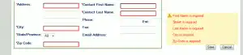

We didn't have room on our pages for individual message boxes, and also had the need to **style specific fields on our JSF pages whenever validation failed on the server,** with **user friendly field names in the message.** Example:  "User Name is Required" , and the field for User Name is highlighted red. \[caption id="attachment_864" align="aligncenter" width="300" caption="Custom field styling and nicer field names for JSF validation"\]\[/caption\] Unfortunately there are times when jsf insists on inserting field ids into the message.

### Here's the scenario;

*   If any jsf converter validation fails (like a string in an int field) JSF will throw a warning like "jid17:jid34: Values must be type numeric" - The form id and page id prepend any internal messages - gross.
*   If any page custom validation fails (like min and max lengths) JSF will throw our custom message
*   If custom validators fail(like the format of a zip code based on the province as US or CA) throw  a custom message
*   If any DB rule issues fail (like name in use by other user) then our Manager throws a custom message (but it is not hooked to any component)

The troubles is that without overriding JSF components or classes we do not have access to the component when every message is thrown, and would be unable to change its style class. Rather than relying on some tricky JSF or Java code to intercept and update classes I decided to take a simpler approach (or so I think).  **Using jQuery, the preprendId="false" attribute, and specific Messages for every field we can do ANY custimaztion we want to ANY failed field, input, checkbox, etc on the page.**

Here's the Solution
-------------------

There is actually a few pieces to the puzzle, but all very simple.

*   Set prependId="false" on the <h:form> elements of your page (optional  but must be consistent for all forms that will use this validation)
*   Give your fields User Friendly names (well sort of, we use JQuery to replace any "_" with spaces )
*   If your ever throwing a custom message, prepend the user friendly(almost) id to your message (we use jquery to strip it off)
*   Give your <h:messages /> element a specific ID.
*   Insert The jQuery client side fixer upper and styl-o-matic to your template. (its like 5 lines)

Hiding the default form ID in JSF
---------------------------------

This is something you will only want to do if all forms can be treated equally in your code elsewhere. Other the id may be important. If you want to leave the form ID in tact, skip this section. But you will need to modify the steps below to accomidate Hiding the form's id is simple, just insert the attrinute prependID="false" in your forms.

 ... components, etc... 

Giving JSF Components User Friendly field names that include spaces
-------------------------------------------------------------------

By the law of html element ids must be alphanumeric, no spaces. So when you name a field "frstNme" in JSF, there's a good chance a user will see it on some failed validation at some point. To compensate, give all your fields nice names that would be pleasant to users, if only for spaces. "First_Name" is prettier, but not what the user will see. The jQuery code replaces all underscores with spaces, so the user would see "First Name...." You could also user hypens.

Include field names when passing custom messages from Java code
---------------------------------------------------------------

This one seems weird, but allows for the most consistency aligning our custom messages with JSF's defaults. In my managers I throw messages like this:

public String saveUserAction(){ 
	 ...
	if(searchString.length()>15)
	{
		addMessage("First_Name:Must be between 2 and 16 characters");
		return null;
	}
	...
	return navString;
}

private void addMessage(String messageStr){
	FacesMessage message = new FacesMessage( messageStr);
	FacesContext.getCurrentInstance().addMessage("errorTag", message);
}

Give your Message components a specific ID
------------------------------------------

All pages that you want to apply this to should have a message element like;

We will need that so jQuery knows where to looks for messages.

jQuery code to cleanup JSF messages and apply field level styling
-----------------------------------------------------------------

The jQuery snippet (well plain JS too) is where this all comes together. We iterate through all the*   elements in the
    element with our messages ID. Each list item may be a field message, and have the format "field_name:message to show user". We check for a colon, and if present split on that as a delimiter, getting an id in the first bucket, and the message in the second. We can then apply styling to a field matching that id before finally fixing the ID to contain spaces, and showing the complete message to user.
    
    $('#messageList li').each(function(i) { // for each li in ul 
            var id=$(this).text().split(':'); // split on colon
            if(id.length>1){ // if field id was present, go to work
    		$('#'+id\[0\]).css('color','red'); //make faulted field fonts red
                    $('#'+id\[0\]).css('border-color','red'); // make faulted fields border red
                    id\[0\]=id\[0\].replace(/_/g," "); // replace any "_" with spaces
                    $(this).text(id\[0\] + ' ' + id\[1\]); // make new message the nicer way
            }
    });
    
    What if I can't use prependID="false" ?
    ---------------------------------------
    
    IF you can't or do not want to use that attribute, make the following changes: \*Prepend the form's Id to your messages (ex: "jidt23:First\_Name:Message to user") \*Adjust jQuery to use buckets 1 and 2 sperated by a colon for the field id (jidt23:First\_Name), and then discard 1, run replace on 2, and show 2 and 3 as the message (First Name is required).
    
    Summary
    -------
    
    That's it! it turned out to be quite simple, and we were able to refactor our existing application of about 25 pages (cleaning up field ids and error messages) is less than 2 hours.
