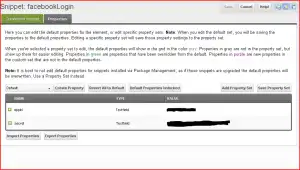

Although still very new, and with much to learn I am loving Modx as a tool to quickly build out robust sites. Recently **a client wanted to add Facebook Integration to their MODx site**. I've used Facebook's API before, and know it makes authentication pretty easy, but I had to figure out to insert that authorized user into Modx's web context. And it was actually quite easy as well. The user becomes a full blown member, and can be treated the same as any user that registered. (you can also treat them differently) Read on to learn how two simple snippets allow Facebooks users to add themselves to your site in the provided member groups. The extra also **creates a full user profile in modx based on Facebook**'s info, complete with:

*   Name
*   Username
*   Email
*   Hometown
*   Photo

Finally, in case you want to add more social features using their Javascript API we make the appID and session available to the front end using placeholders.

### Important:You Must Have Basic Login working using Login

**This article assumes you already have basic authentication working for your users using [Shaun and Jason's_Login_ extra](http://rtfm.modx.com/display/ADDON/login "Login Extra for Modx").   They also has great docs, so I'll spare you.** _But,_ I strongly suggest 3 things:

1.  A dedicated Login/Logout page
2.  A Login Link that shows to unknown users that simply links to the dedicated page <a href="[[~29]]">Login</a>
3.  A Logout link shown to authenticated users that links to the same page, but specifies logout. <a href="[[~29? &service=`logout`]]">Logout</a>

[Shaun's IF extra](http://rtfm.modx.com/display/ADDON/If) is a great way to manage that choir:

#### LoginChunk used on all pages

[[!If?
   &subject=`[[+modx.user.id]]`
   &operator=`empty`
  
   &then=`
      [Login]([[~29]]), 
    [Register]([[~27]])
    `
&else=`
	[[!Profile]]		
        Welcome Back, [[[+modx.user.username]]](/users/my-profile.html)  | 
        [Logout]([[~29? &service=`logout`]] "Logout")
`
]]
     
  

  Once you're all setup and working with that, read on.  

### Facebook API

You'll want to visit [Facebook's developer site](http://developer.facebook.com) and get yourself and application ID.  They have great documentation, so I wont regurgitate it. While you are there, be sure to grab the [PHP Client](https://github.com/facebook/php-sdk/ "PHP Client Library for Facebook") they provide. ( you can save a step by using wget from your server to download the [sdk tarball](https://github.com/facebook/php-sdk/tarball/master) as well) Now that facebook nows about your app, and you have an application ID and secret we can add our 2 snippets to MOdx, and upload the PHP Client and Certificate.   **Note**: Once you have created the two snippets below, you will need to provide them to _both_ snippets as default properties. [caption id="attachment_953" align="aligncenter" width="300" caption="Edit the snippets, click "Properties" > "Unlock Default Properties" and then add the two values "appId" and "secret""][/caption]

#### Upload the facebook client

I chose to put the php class under _core/components/facebookLogin/_ , and reccomend you do as well, because I plan to release all this as an extra very soon. (and that will keep the transition smooth) You can use the file explorer to create the folder, but MOdx wont let you upload the PHP file. So you will need to ftp the file to the server or use wget right from the server. But in the end you need this, a directory with Facebook.php and fb_ca_chain_bundle.crt.  We will call the facebook.php file in later steps.   

### Creating the facebookLogin snippet for Modx

  First add a new category named facebookLogin (again, keeps life easy), and write two new snippets, facebookLogin, and facebookLogout.  The Login snippet outputs the Connect With Faceboook button, so you can just include it in the above code, right next to the login link.

#### Updated LoginChunk used on all pages

[[!If?
   &subject=`[[+modx.user.id]]`
   &operator=`empty`
  
   &then=`
      [Login]([[~29]]), 
    [Register]([[~27]])
    [[!facebookLogin? &userGroups=`Members`]]
    `
&else=`
	[[!Profile]]		
        Welcome Back, [[[+modx.user.username]]](/users/my-profile.html)  | 
        [Logout]([[~29? &service=`logout`]] "Logout")
`
]]

(Note: The extra will eventually use a chunk as a template to allow you to customize the text or image shown easily, this is more aligned with Modx's recommended architecture as well, so bonus if you just implement that from the get go.)

/**
  *FacebookLogin Snippet for Modx
  * FacebookLogin is free software; you can redistribute it and/or modify it
 * under the terms of the [GNU General Public License](www.gnu.org/licenses/gpl-2.0.html) as published by the Free
 * Software Foundation; either version 2 of the License, or (at your option) any
 * later version.
 *
 * FacebookLogin is distributed in the hope that it will be useful, but WITHOUT ANY
 * WARRANTY; without even the implied warranty of MERCHANTABILITY or FITNESS FOR
 * A PARTICULAR PURPOSE. See the [GNU General Public License](www.gnu.org/licenses/gpl-2.0.html) for more details.
 *
 * You should have received a copy of the [GNU General Public License](www.gnu.org/licenses/gpl-2.0.html) along with
 * FacebookLogin; if not, write to the Free Software Foundation, Inc., 59 Temple
 * Place, Suite 330, Boston, MA 02111-1307 USA
*/
/**

A substantial chunk of Jason Coward's and Shaun McCormick's Login snippet was used, and noted in the code below

*/
/**
 * Login
 *
 * Copyright 2010 by Jason Coward and Shaun McCormick
 * *
 * Login is free software; you can redistribute it and/or modify it
 * under the terms of the GNU General Public License as published by the Free
 * Software Foundation; either version 2 of the License, or (at your option) any
 * later version.
 *
 * Login is distributed in the hope that it will be useful, but WITHOUT ANY
 * WARRANTY; without even the implied warranty of MERCHANTABILITY or FITNESS FOR
 * A PARTICULAR PURPOSE. See the GNU General Public License for more details.
 *
 * You should have received a copy of the GNU General Public License along with
 * Login; if not, write to the Free Software Foundation, Inc., 59 Temple
 * Place, Suite 330, Boston, MA 02111-1307 USA
 *
 */
require_once $modx->getOption('core_path').'components/facebookLogin/facebook.php';

//what permissions do we want
$par = array();
$par['req_perms'] = "email,user_hometown,user_website";

//
// Where do these come from? Add them as Properties to the snippet!
//
$appId= $modx->getOption('appId',$scriptProperties,'');
$secret= $modx->getOption('secret',$scriptProperties,'');

if(empty($appId) || empty($secret)){
$output='No AppID or Secret Provided, please obtain from developer.facebook.com';
return $output;
}

// Create our Application instance.
$facebook = new Facebook(array(
  'appId' => $appId,
  'secret' => $secret,
  'cookie' => true,
));

$session = $facebook->getSession();

/*
* Make the appID and current session available to the front end 
* (in case you want to add more social features using Javascript, specify those in the init() call)
*/
$modx->toPlaceholder('facebook_session',json_encode($session));
$modx->toPlaceholder('facebook_app_id',$facebook->getAppId());

$output="";

$me = null;
// Session based API call.
if ($session) {
  try {
    $uid = $facebook->getUser();
    $me = $facebook->api('/me');

  } catch (FacebookApiException $e) {
    error_log($e);
  }
}

// login or logout url will be needed depending on current user state.
if ($me) {
//die(print_r($me));

	$contexts = empty($contexts) ? array($modx->context->get('key')) : explode(',', $contexts);
	    foreach (array_keys($contexts) as $ctxKey) {
		$contexts[$ctxKey] = trim($contexts[$ctxKey]);
	    }

	$user = $modx->getObject('modUser',  array('remote_key:=' => $me['id'], 'remote_key:!=' => null));

	if(empty($user)){
	    	//their new!
		//facebook may pass multiple hometowns back
		if(!empty($me['hometown'])){
			if(is_array($me['hometown'])){
			   $homet=$me['hometown'][0];
			}else{
       			   $homet=$me['hometown'];
			}
		}

	  	// Create an empty modx user and populate with facebvook data
		$user = $modx->newObject('modUser');
		$user->fromArray(
                          array('username' => $me['name'],'active' => true
		                ,'remote_key' => $me['id'] ,'remote_data' => $me //store the remote data as json object in db (in case you need more info bout the FB user later)
		             )
                   );

//We'll also toss a profile on to save their email and photo and such
		$profile = $modx->newObject('modUserProfile');
		$profile->fromArray(array(
		'email' => isset($me['email']) ? $me['email'] : 'facebook-user@facebook.com'
		,'fullname' => $me['name']
		,'city' => $homet
                ,'photo'=> 'http://graph.facebook.com/'. $me['id'] .'/picture'
		));
		$user->addOne($profile, 'Profile');

/** Login, (C) 2010, Jason Coward, Shaun McCormick**/

		/* if usergroups set */
		$usergroups = $modx->getOption('usergroups',$scriptProperties,'');
		if (!empty($usergroups)) {
		    $usergroups = explode(',',$usergroups);

		    foreach ($usergroups as $usergroupMeta) {
			$usergroupMeta = explode(':',$usergroupMeta);
			if (empty($usergroupMeta[0])) continue;

			/* get usergroup */
			$pk = array();
			$pk[intval($usergroupMeta[0]) > 0 ? 'id' : 'name'] = $usergroupMeta[0];
			$usergroup = $modx->getObject('modUserGroup',$pk);
			if (!$usergroup) continue;

			/* get role */
			$rolePk = !empty($usergroupMeta[1]) ? $usergroupMeta[1] : 'Member';
			$role = $modx->getObject('modUserGroupRole',array('name' => $rolePk));

			/* create membership */
			$member = $modx->newObject('modUserGroupMember');
			$member->set('member',0);
			$member->set('user_group',$usergroup->get('id'));
			if (!empty($role)) {
			    $member->set('role',$role->get('id'));
			} else {
			    $member->set('role',1);
			}
			$user->addMany($member,'UserGroupMembers');
		    }//end foreach
		}//end user grops
/** End Login Code Block froom Login, (C) 2010 Jason Coward, Shaun McCormick **/
		$saved = $user->save();
	}//end if new user

	//new or not, they're logged in
        if(!$user->hasSessionContext('web')){
	   foreach ($contexts as $context) {
		$user->addSessionContext($context);
	   }

	   $modx->sendRedirect('/');
        }

} else {
	//else give them the chance to login
/* This should parse the generated URL with a chunk, for now you can edit the image or text here */
  	$output.= '.')';
}

return $output; 

Now just call that snippet, with the optional attribute of "userGroups" to add group membership for new users. That attribute, like Login's accepts a comma separated list of groups.

[[!facebookLogin? &usergroups=`Members`]]

**Well there you have it, users can now authenticate against facebook, and if they grant permissions, MODX will be able to add them as a new user complete with email, photo and hometown**. ..Oh what's that? You want them to be able to logout too. OK, ok..

#### facebookLogout _hook_ for Modx's Login Extra

The login code above adds the Facebook user as a fully fledged user. SO if you have Jason and Shaun's Login extra working properly they should see a logout link. But what happens when you click it?

> Modx says _Logout_!, Done. Redirect to whatever page. Facebook extra says _Hey! i know you welcome back_, and adds user back into the current context.

So unless we also tell Facebook that the user is logging out, they will never be able to logout again! Oh my.. So the solution is use the facebookLogout snippet as a post hook. This allows MOdx and facebook to work in tandem.

> Modx says _Logout_!, Done. Redirect _to Facebook's logout URL_. Facebook kills authentication session, sends back to whatever page. Facebook extra still checks, but can not load the previous session

/**
  *FacebookLogin Snippet for Modx
  * FacebookLogin is free software; you can redistribute it and/or modify it
 * under the terms of the [GNU General Public License](www.gnu.org/licenses/gpl-2.0.html) as published by the Free
 * Software Foundation; either version 2 of the License, or (at your option) any
 * later version.
 *
 * FacebookLogin is distributed in the hope that it will be useful, but WITHOUT ANY
 * WARRANTY; without even the implied warranty of MERCHANTABILITY or FITNESS FOR
 * A PARTICULAR PURPOSE. See the [GNU General Public License](www.gnu.org/licenses/gpl-2.0.html) for more details.
 *
 * You should have received a copy of the [GNU General Public License](www.gnu.org/licenses/gpl-2.0.html) along with
 * FacebookLogin; if not, write to the Free Software Foundation, Inc., 59 Temple
 * Place, Suite 330, Boston, MA 02111-1307 USA
*/

//Login doesn't provide separate hook calls for logging or logging out, so we check..
$islogout = array_key_exists('logoutResourceId', $hook->getValues());

if($islogout){

require_once $modx->getOption('core_path').'components/facebookLogin/facebook.php';

//
// Where do these come from? Add them as Properties to the snippet!
//
$appId= $modx->getOption('appId',$scriptProperties,'');
$secret= $modx->getOption('secret',$scriptProperties,'');

// Create our Application instance.
$facebook = new Facebook(array(
  'appId' => $appID,
  'secret' => $secret,
  'cookie' => true,
));

$session = $facebook->getSession();

$modx->toPlaceholder('facebook_session',json_encode($session));
$modx->toPlaceholder('facebook_app_id',$facebook->getAppId());

$me = null;
// Session based API call.
if ($session) {
  try {
    $uid = $facebook->getUser();
    $me = $facebook->api('/me');

  } catch (FacebookApiException $e) {
    error_log($e);
  }
}

if($me){
     //we are logging out but facebook is still logged in, kill session
     die($modx->sendRedirect($facebook->getLogoutUrl()));
}

 // they are logging out, but not FB user, do nothing

}else{

       //just logging in
       $modx->sendRedirect('/users');
}

SO how do we call that code? Remember you're dedicated Login/Logout page?

[[!Login? &tplType=`modChunk` &loginTpl=`lgnLoginTpl`]]

Just add the logout snippet as a posthook

[[!Login? &tplType=`modChunk` &loginTpl=`lgnLoginTpl` &postHooks=`facebookLogout`]]

> That's everything I think. As I said I am still new to MOdx, and have much to learn, so don't hold back on the input.
