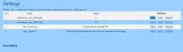

When delivering an application that will be administered by clients I found it best to keep them out of the source code. THis means that any options, any at all, should be editable from a frontend.  Site name, taglines and metadata are examples of such settings.  Any constants that will be changed (Oxy-moronic I know) can also go here.

The Problem
-----------

Letting your client edit  site_details.php just to change the site's tagline ends up in 500 errors or the like.

The Solution
------------

Implement a simple settings component that records simple key => value pairs.

*   Model
*   Controller
*   View
*   Using the Values in your Code

This allows them to tinker with any values you deem fit. For example the KEY 'site_name' could have a VALUE of 'Charlie's World'.

Implementation
--------------

### The Settings Model

THe single method in the model will read only the values we care about for a particular controller and return them to that controller. **To get an idea of how to call values from a controller [read this article on my logical botcheck](https://blog.edwardawebb.com/programming/php-programming/cakephp/logical-bot-check-cakephp-captcha).**

 array( 
				array(  
 				'required' => array('rule'=>VALID_NOT_EMPTY,'message'=>'Must not be empty!'),  
 				'length' => array( 'rule' => array('maxLength', 20),'message'=>'That Key is a bit too long, keep it under 20 characters' )  
 				)),
			'value' => array( 
				array(  
 				'required' => array('rule'=>VALID_NOT_EMPTY,'message'=>'Must not be empty!'),  
 				'length' => array( 'rule' => array('maxLength', 60),'message'=>'That Value is a bit too long, keep it under 60 characters' )  
 				))
		);

	function getBotcheckMinMax(){
		$min=0;
		$max=0;
		
		$full_result=$this->findAll(array('key like'=>'botcheck_%_difficulty'));
		
		
		foreach($full_result as $record){
			switch($record['Setting']['key']){
				
				case 'botcheck_min_difficulty':
				$min=$record['Setting']['value'];
				break;
				
				
				case 'botcheck_max_difficulty':
				$max=$record['Setting']['value'];
				break;
				default;
			}
		}
		$result=array('min'=>$min,'max'=>$max);
		//die($min.'--'.$max);
		return $result;
	}	
}
?>

### The Settings Controller

checkSession(4);		

	}

	

	function index() {

		$this->Setting->recursive = 0;

		$this->set('settings', $this->paginate());

	}

	function view($id = null) {

		if (!$id) {

			$this->Session->setFlash(__('Invalid Setting.', true));

			$this->redirect(array('action'=>'index'));

		}

		$this->set('setting', $this->Setting->read(null, $id));

	}

	function add() {

		if (!empty($this->data)) {

			$this->Setting->create();

			if ($this->Setting->save($this->data)) {

				$this->Session->setFlash(__('The Setting has been saved', true));

				$this->redirect(array('action'=>'index'));

			} else {

				$this->Session->setFlash(__('The Setting could not be saved. Please, try again.', true));

			}

		}

	}

	function edit($id = null) {

		if (!$id && empty($this->data)) {

			$this->Session->setFlash(__('Invalid Setting', true));

			$this->redirect(array('action'=>'index'));

		}

		if (!empty($this->data)) {

			if ($this->Setting->save($this->data)) {

				$this->Session->setFlash(__('The Setting has been saved', true));

				$this->redirect(array('action'=>'index'));

			} else {

				$this->Session->setFlash(__('The Setting could not be saved. Please, try again.', true));

			}

		}

		if (empty($this->data)) {

			$this->data = $this->Setting->read(null, $id);

		}

	}

	function delete($id = null) {

		if (!$id) {

			$this->Session->setFlash(__('Invalid id for Setting', true));

			$this->redirect(array('action'=>'index'));

		}

		if ($this->Setting->del($id)) {

			$this->Session->setFlash(__('Setting deleted', true));

			$this->redirect(array('action'=>'index'));

		}

	}

}?>

### The Settings Views

These are standard CakePHP views and can be baked from the model above, no point in wasting precious bits on that.

### Using the Settings Values in your Code

OK, so we can add, edit and delete all the settings we want. [Using these values is as simple as calling them from another controller](https://blog.edwardawebb.com/programming/php-programming/cakephp/logical-bot-check-cakephp-captcha "See example using the Settings stored by this component")

Summary
-------

The end result is a editable collections of Settings that can be used by various other pages or controllers.  Well there you have it. A over simplified explanation of my Settings component. Feel free to ask questions.
