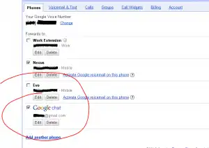

You may have seen the news recently that Gmail can not place calls to your contacts through the use of a browser plugin, and google voice's VOIP infrastructure. All you need is a headset or microphone for your PC to send calls. **But the best part is the flip side -- calls to my Google Voice number can reach me in Gmail chat !** So along with ringing my work extension and mobile phone, I will get your call in my (always open) gchat window ! \[caption id="attachment_829" align="aligncenter" width="300" caption="Calls to google voice numbers can now also ring your gchat session"\]\[/caption\]
