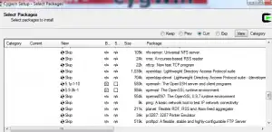
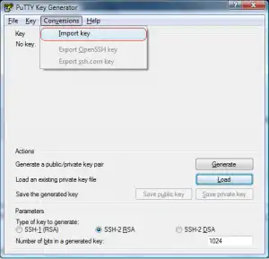
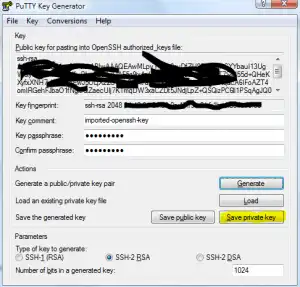
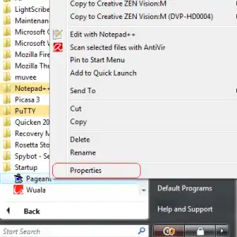

**Tools like PuTTY and Cygwin allows users trapped in a window's world to retain some of the power and functionality of 'nix platforms**.  Together or independently they allow users on windows machines to SSH, SCP and interface with Linux, Unix, Solaris, or even AIX nodes.  The absolute best part? You can generate a pair of keys to make remembering passwords a thing of a the past.   This is especially important to one's sanity if you work in an environment with 10s or 100s of different nodes that all have rotating IDs on different schedules.   So my goal in the article that follows is to setup a powerful workstation that includes Cygwin, PuTTY, and WinSCP.  WinSCP is not a necessary tool, but I'll admit I like to resort to a graphical SCP tool every now and again.  **Unlike a few other articles I have read I will not encourage you to use passphrase-less keys, just too risky in my mind.**  Instead we will just limit the number of times we need to enter that password to say about.... 1. To recap, our Goals are;

*   Install powerful windows based tools. (Cygwin, PuTTY and WinSCP)
*   Generate a pair of 2048 bit RSA keys (With a passphrase)
*   Disseminate the public key to all the nodes we know (or connect to)
*   Employ Pageant and SSH-Agent to limit the need to enter that single passphrase.

So let's get started.

Installing the Tools
--------------------

Most anyone who works with Unix nodes from a window's desktop knows the joy of PuTTY. Perhaps a few less know about Cygwin.  These tools are a must have in any IT toolbox.

### Cygwin

Cygwin, available [here](http://www.cygwin.com/ "Learn more about Cygwin and download a copy for yourself."), allows Unix like commands to run in a windows command console.   When installing the utility we need to make sure to check off a few extras that are not part of the default install. Kick off the install until you get to a list of the components to install. Expand the Net category and check off OpenSSH and OpenSSL.  Let the installation complete normally otherwise.

### PuTTY

You know all about PuTTY I am sure.  My only real advice here is to download the complete PuTTY suite of tools with the installer. There are two main perks to this.  1) You get all the goodies like PuTTYGen and Pageant. 2) If your running Vista you won't get those annoying UAC alerts every time you kick it off. You can find the PuTTY suite [here](http://www.chiark.greenend.org.uk/~sgtatham/putty/download.html "Download all the PuTTY tools."). Be sure to grab the one listed under "A Windows installer for everything except PuTTYtel." Don't worry, if you already had the stand alone utility installed, it will preserve all yoru settings so long as you install to the same folder.

### WinSCP

WinSCP is a graphical interface for moving files between your local machine and remote servers.  If you want to stay true to your terminals you can just stick with Cygwin and the SCP utility (which we've already installed). Grab WinSCP from [here](http://winscp.net/eng/download.php "Download WinSCP, an open source graphical SCP tool."), no special install needed.

Generating our Keys
-------------------

OK!  So now we can connect to our remote servers any way conceivable to man. Well maybe that's an over statement, but I think our bases are pretty well covered. The next hurdle is to create a pair of digital keys.  We keep one key (the private key) on our local machine, and never share it with anyone.  We disseminate (or distribute) the other key (public) out to any server we want to connect to.  The key pair will be reunited on connection allow us to authenticate without entering our password for the remote server. First open up Cygwin.  Ahh isn't she beautiful. Type _ssh-keygen -t rsa_ at the prompt and follow the queues entering information.  **Be sure to enter a passphrase!** You may accept the default path for a key location.

$ ssh-keygen -t rsa
Generating public/private rsa key pair.
Enter file in which to save the key (/home/Eddie/.ssh/id_rsa):
Created directory '/home/Eddie/.ssh'.
Enter passphrase (empty for no passphrase):
Enter same passphrase again:
Your identification has been saved in /home/Eddie/.ssh/id_rsa.
Your public key has been saved in /home/Eddie/.ssh/id_rsa.pub.
The key fingerprint is:
74:17:ef:24:e6:5f:1b:f3:e0:6a:1b:fe:ae:a6:fe:24 Eddie@HP-dv6z-420
The key's randomart image is:
+--\[ RSA 2048\]----+
|  .-o.           |
|\+ .o*  .         |
|+F .o . o        |
|..o  + .         |
|  \-     S        |
|   \-             |
|   \+\-  F  o      |
|.  .G . .        |
| o+*+o     o     |
+-----------------+

Now since you should be in your home directory you can type _ ls -a_ and you should notice a new directory _.ssh_ inside their will be your public (id-rsa.pub) and private (id-rsa) keys. If you chose an alternate path while generating the keys, be sure to move the private key into this folder.

### Disseminate our Public Key

We'll stick with Cygwin for a bit longer and use it's scripting abilities to share our public key with any servers we want to connect to. If you only have one remote server in mind than a script is probly overkill, but you will want to follow the steps within the script. In my case I have about 20 servers, so I'll take all the automation I can get.

#### The Dissemination Scripts

There are two scripts. One runs locally, and the other gets sent over SCP and then runs as our remote henchmen before being purged like a failed hitman.

##### Script 1 - Called Locally 

#! /bin/bash
\# Author: Eddie Webb - edwardawebb.com

\# Deploys a public SSH key to multiple remote nodes. It will convert from Putty Format

\# Calls Script:
#	addPublicKeyRemotely.sh

\## Check arghuments
if \[ $# -ne 1 \]
then
	printf "Usage: \\n %s PuttyPubKey\\n\\n" \`basename $0\`
fi

#create a log file
LOGFILE=Results.log

SERVERS=( server1 server2 funnyname anotherserver )
#NOte: if your username is different on each node - make an array below that correspoinds to the node list above
USER=YOUREMOTEUSERNAME

SSHKEY=$1
SSHKEYBASE=\`basename $1\`
SCRIPTPATH=\`dirname $0\`

\## loop thorugh all servers sending key and remote script - purges afer script runs.
for (( i = 0 ; i < ${#SERVERS\[@\]} ; i++ ))
do
	echo Sending to Host ${SERVERS\[$i\]}
	scp $SSHKEY $SCRIPTPATH/addPublicKeyRemotely.sh $USER@${SERVERS\[$i\]}:~/
	ssh $USER@${SERVERS\[$i\]} "~/addPublicKeyRemotely.sh $SSHKEYBASE;rm -f ~/addPublicKeyRemotely.sh" >> $LOGFILE
	if \[ $? -eq 0 \]
	then
		echo Key successfully pushed to ${SERVERS\[$i\]} >> $LOGFILE
		echo SUCCESS
	else
		echo FAILED pushing key to ${SERVERS\[$i\]} >> $LOGFILE
		echo FAILED
	fi
	printf "\\n\\n\\n"
done

 

##### Script 2 - Called remotely - Name important (addPublicKeyRemotely.sh)

#!/bin/bash
\# Author: Eddie Webb - edwardawebb.com

\# Called by Script:
#		promotePublicKey.sh

\# Arguments:
#		name of converted SSH key 

\# this file is uplaoded to remote serveres and called to handle remote work before being deleted.

	if \[ ! -d .ssh \]
	then
		mkdir -p .ssh
	fi
	touch .ssh/authorized_keys
	chmod 0600 .ssh/authorized_keys
	cat $1 >> .ssh/authorized_keys
	rm -f $1

  Run the first script specifying your **PUBLIC** key as the only parameter. Now the downside is that you will still need to enter your remote passwords for each server, but hey it will be the last time. The result should look something like;

$ scripts/promotePublicKey.sh .ssh/id_rsa.pub
Sending to Host domain.com
YOURUSER@domain.com's password:
id_rsa.pub                                    100%  399     0.4KB/s   00:00
addPublicKeyRemotely.sh                       100%  387     0.4KB/s   00:00
YOURUSER@domain.com's password:
SUCCESS

 

### Testing Cygwin

You should now be able to make a remote connection entering only your new key passphrase(the passwordless part is yet to come).  

$ ssh YOURUSER@domain.com
Enter passphrase for key '/home/Eddie/.ssh/id_rsa':

Don't worry, you won't always enter the passphrase, that was a test. Be patient with me :)    

### Importing to PuTTY

Putty uses its own format for private keys (PPK) so we need to import our openSSH private key and convert it to a PPK for Putty to use. We'll do this without overwritting the private key we have (still needed by Cygwin). Open up PuTTYgen from your start menu. First _Load_ your existing private key (C:\\cygwin\\home\\<YOURNAME>\\.ssh\\id-rsa) \[caption id="attachment_464" align="aligncenter" width="300" caption="Import existing key to PuTTYge"\]\[/caption\]  After you import the key you will be asked for your key's passphrase before seeing the screen below. It lists the details about your public key. \[caption id="attachment_465" align="aligncenter" width="300" caption="The imported key in PuTTYgen"\]\[/caption\] Finally click the _Save private key_ button (highlighted in Yellow)  this will save the priavte key as a PPK file. I typically save this in my PuTTY installation directory under a folder names _Keys._ **Do not overwrite your existing key**, and keep the PPK extension.     

Repetitive Entry Avoidance (A.K.A. Enter the passphrase once, and only once)
----------------------------------------------------------------------------

Now we need to modify PuTTY and Cygwin to keep our keys in memory so we only enter the passphrase once per session.

### Using Pageant

Pageant, which installed with PuTTY, will hold the keys open for PuTTy and WinSCP. Find the shortcut to Pageant in your start menu. Make a copy of the shortcut and paste it into your _Startup_ menu. This will kick off pageant every time windows boots. However, we need to tell the shortcut to load our private key. Now right-click that icon and select properties.  Edit the entry that says _Target_ and change it from; "C:\\Program Files (x86)\\PuTTY\\pageant.exe" To; "C:\\Program Files (x86)\\PuTTY\\pageant.exe" "C:\\Program Files (x86)\\PuTTY\\Keys\\id-rsa.ppk"  Click _Apply_ and then close the properties window.   Now try clicking the icon. It should immediately ask you for your passphrase. This is the same prompt you will see next time you boot windows. Go ahead an test out PuTTY now. You will not be prompted for a password, and instead will see something like'

Using username "YOURUSER".
Authenticating with public key "imported-openssh-key" from agent

### Using SSH-Agent for Cygwin

Cygwin doesn't use PuTTY's ppk file, so we need a manner to retain the private id-rsa key within our Cygwin sessions. Add the following script to your _.bash_profile_;  

\## only ask for my SSH key passphrase once!
#use existing ssh-agent if possible
if \[ -f ${HOME}/.ssh-agent \]; then
   . ${HOME}/.ssh-agent > /dev/null
fi
if \[ -z "$SSH\_AGENT\_PID" -o -z "`/usr/bin/ps -a|/usr/bin/egrep \\"^\[ \]+$SSH\_AGENT\_PID\\"`" \]; then
   /usr/bin/ssh-agent > ${HOME}/.ssh-agent
   . ${HOME}/.ssh-agent > /dev/null
fi
ssh-add ~/.ssh/id_rsa

  Save the file and hop back to Cygwin.  You can either restart Cygwin, or source the profile file to test this feature out. Since I left Cygwin open I'll just source the file.

$ . .bash_profile
Enter passphrase for /home/Eddie/.ssh/id_rsa:
Identity added: /home/Eddie/.ssh/id\_rsa (/home/Eddie/.ssh/id\_rsa)

Now you SSH to eighty different servers and not enter the passphrase again!

Conclusion
----------

We're done! Thanks for bearing with my article, I know it was not too concise, but I hope you forged through it. If you have any questions, let me know.
