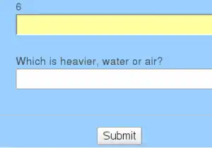

Spam is bad agreed? Of course. But making readers painfully decode swirled letters and numbers is nearly as bad. That is why many sites will **use logic questions to prevent spam and bot activity**. **Implementing logic questions on your mail forms and registration is easy for your readers and simple for you.** This tutorial walks through the steps to create one using CakePHP.  The solution will pick  a random question and answer stored in the database and based on desired difficulty. Hooray!

Problem
-------

There be spam bots trying to get your treasure!  Or at least submit annoying emails and comments.

Solution
--------

Ask the kind of simple and random questions that a bot just wouldn't understand.  Some of my favorites;

*   "Just one question - What is GOD spelled backwards?"
*   "Is this a question?"

Implementation
--------------

So its all fine and dandy hard code a question into your forms, then hard code a check into your controllers, but it sure isn't OO, and its definitely not CakePHP. WHat if instead **we threw a whole bunch of random questions into a DB, and pulled one each time someone went to a form**?  Yes that would be nice indeed.  We will need to hold  a corresponding answer as well. THere are a few parts to this solution, so pay attention.

*   Managing site Settings
    *   Model
    *   Controller
    *   Views

*   Managing the Questions and Answers
    *   Model
    *   Controller
    *   Views (add/edit etc.)

*   Supplying the Q&A to forms
    *   BeforeFilter method

### Managing Site Settings - Settings

Now this MVC group is optional.  I deliver a lot of prototypes to clients and found that asking them to edit any source file just introduces more problems.  For example if they want to change the site's title, or tagline, or other metadata. TO solve this I provide a simple Settings model that stores these values in a user friendly way. [Read how to use a Global Settings Component for your CakePHP Site](https://blog.edwardawebb.com/programming/php-programming/cakephp/global-site-settings-component-cakephp "Read how to use a Global Settings Component for your CakePHP Site") If it is a personal site or you just don't care for this you'll need to adjust  how we obtain in the difficulty levels in the next model.

### Managing Questions and Answers - BotCheck

**At the heart of my solution is a Model. I named it BotCheck**, but you could call it PussNBoots for all I care.

#### app/models/botcheck.php

 VALID\_NOT\_EMPTY,
		'answer' => VALID\_NOT\_EMPTY,
		'difficulty' => VALID\_NOT\_EMPTY,
	);

	var $recursive = -1;	

	var $minDiff=1;
	var $maxDiff=10;

	 

/\*\*
 \* set level to use
 \* 
 */

	function setMinMax($minMax=array()){	
		//import settings model to pull from method getBotcheckMinMax
		App::import('Model','Setting');
		$ms=new Setting();
		$minMax=$ms->getBotcheckMinMax();
		//debug(Configure::read('App.botcheck\_min\_difficulty'));
		
		//now set the locAL varable 
		$this->minDiff=$minMax\['min'\];

		$this->maxDiff=$minMax\['max'\];	

	} 

	/\*\*
	 \* Grabs a random question and answer from the database. 
	 \* Only use minmaxoverride to circumvent table settings.
	 \* 
	 \* @param array minMaxOverride
	 *
	 */

	function getFreshBotcheck($minMax=null){			

		//we need to load the settings form the settings table/model
		$this->setMinMax();		

		// set conditions for highest and lowest difficulty to pull
		$conditions=array('difficulty >='=>$this->minDiff,'difficulty <='=>$this->maxDiff);		

		//get nuimber of rows that match
		$rows=$this->findCount($conditions);	

		$record=rand(1,$rows);

		//use random number as page (doesnt depend on record ids)
		$result=$this->findAll($conditions,null,null,1,$record);

		

		//we let answers be sets seperated by commas, make it an array after making it all lowercase
		$answers=split(',',strtolower($result\[0\]\['Botcheck'\]\['answer'\]));

		

		//simplify results into a \['question'\] and \['answer'\] keyed variable for direct pull
		$fbc=array('question'=>$result\[0\]\['Botcheck'\]\['question'\],'answers'=>$answers);

		return $fbc;
	}

}

?>

#### app/controllers/botchecks_controller.php

Session->read('User');
		if($user\['Role'\]\['rights'\]>=2)$this->redirect('/admin/'.Inflector::underscore($this->name).'/'.$this->action);
	}

	function admin_index() {
				
		$this->Botcheck->recursive = 0;
		$this->set('botchecks', $this->paginate());
		$this->set('bcMin',Configure::read('App.botcheck\_min\_difficulty') );
		$this->set('bcMax',Configure::read('App.botcheck\_max\_difficulty') );
	}

	function admin_view($id = null) {
		if (!$id) {
			$this->Session->setFlash(__('Invalid Botcheck.', true));
			$this->redirect(array('action'=>'index'));
		}
		$this->set('botcheck', $this->Botcheck->read(null, $id));
	}

	function admin_add() {
		if (!empty($this->data)) {
			$this->Botcheck->create();
			if ($this->Botcheck->save($this->data)) {
				$this->Session->setFlash(__('The Botcheck has been saved', true));
				$this->redirect(array('action'=>'index'));
			} else {
				$this->Session->setFlash(__('The Botcheck could not be saved. Please, try again.', true));
			}
		}
	}

	function admin_edit($id = null) {
		if (!$id && empty($this->data)) {
			$this->Session->setFlash(__('Invalid Botcheck', true));
			$this->redirect(array('action'=>'index'));
		}
		if (!empty($this->data)) {
			if ($this->Botcheck->save($this->data)) {
				$this->Session->setFlash(__('The Botcheck has been saved', true));
				$this->redirect(array('action'=>'index'));
			} else {
				$this->Session->setFlash(__('The Botcheck could not be saved. Please, try again.', true));
			}
		}
		if (empty($this->data)) {
			$this->data = $this->Botcheck->read(null, $id);
		}
	}

	function admin_delete($id = null) {
		if (!$id) {
			$this->Session->setFlash(__('Invalid id for Botcheck', true));
			$this->redirect(array('action'=>'index'));
		}
		if ($this->Botcheck->del($id)) {
			$this->Session->setFlash(__('Botcheck deleted', true));
			$this->redirect(array('action'=>'index'));
		}
	}

}
?>

#### app/views/botchecks

**These are standard CakePHP views (view/add/edit/delete) that can be baked via the console based on the above controller.** The views will allow you, or the application admin to add lots random questions and answers. THe nice thing is that answers are an array. So you can ask "what do plants need to survive?" and accept "air" or "oxygen" or "water"..etc. etc.

### Supplying Random Logic Questions to User Forms

Now we have a bunch of questions that are ready to be loaded at will. We will take a look at my User's controller to see **how we pull a random question and answer pair and store them to session**. This way if the user forgets there email, or another form field we can hang on to the same question and answer. No reason to make them feel like they are on quiz show.

#### app/controllers/users_controller.php - snippet

pageTitle= ' // '.Inflector::humanize(Inflector::underscore($this->name)).' '.$this->action;
	
	}
	
	function beforeFilter(){
		//die('Not empty?: '.!empty($this->data));
		
		
		//grab a fresh botcheck question from the db
		//UNLESS there is already one in session AND there is data being passed from a form
		if($this->Session->check('botcheck') && !empty($this->data)){
			//die('we got your stickin session');
			//This indicates we are likely just checking info entered, 
			//be sure to use the same botcheck (hard for users to psychic.)
			$bc=$this->Session->read('botcheck');
		}else{
			//we must get a unique botcheck, since one does not exist, or it is likley from a past event
			$bc=$this->Botcheck->getFreshBotcheck();
			//save it for validation once they attempt to answer
			$this->Session->write('botcheck',$bc);
		}
		//set it to a variable used by actions
		$this->whatWeAsk=$bc\['question'\];
		$this->humanWouldType=$bc\['answers'\];	
		//die($this->whatWeAsk);	
	}
/**
..... MORE CODE
**/
	function notify\_friends\_and_family($wishListId){
		$merror=0;
		$someone=$this->checkSession(1,null,true);
		$wishListArr=$this->User->WishList->find('WishList.id = '.$wishListId);
		if (!$wishListId && empty($this->data)) {
			$this->Session->setFlash('Um... Like, OK.  I dont\\'t wanna be  buzzkill, but like, you totally need to need to visit that page from a wish list. Otherwise I am like totally unable to help you, K?', true);
			$this->redirect(array('controller'=>'WishLists','action'=>'index'));
		}elseif($someone\['User'\]\['id'\]!=$wishListArr\['WishList'\]\['owner_id'\]){
			$this->Session->setFlash('Wow! Your totally trying to notify people of a list you um, like don\\'t own.  Maybe you should like come here from one of your list. Then you like, don\\'t even need to worry and stuff, K?', true);
			$this->redirect(array('controller'=>'WishLists','action'=>'index'));
		
		}
		
		
		//is submitted?
		if (!empty($this->data)) {
			//botcheck!
			if(!in_array(strtolower($this->data\['User'\]\['check'\]),$this->humanWouldType))
			{
			  	$this->User->invalidate('check');			
				$merror=1;
			}			
			//set modified dates to now
			if ($merror==0) {
				
				$wishListArr=$this->User->WishList->find('WishList.id = '.$this->data\['WishListId'\]);
				$this->Email->shareemail($this->data\['email'\],$someone\['User'\]\['first_name'\],$wishListArr);
				$this->Session->setFlash(__('Your messages were sent.', true));
				$this->redirect(array('controller'=>'WishLists','action'=>'view',$this->data\['WishListId'\]));
			} else {
				$this->Session->setFlash(__('Please Correct These Errors', true));
			}
		}
		// grab botcheck question
		$this->set('botQuestion',$this->whatWeAsk);
		$this->set('wishlist',$wishListArr);
		
	}

Notice 3 things;

1.  We declare our BotCheck model in the 'Uses' line
2.  We set default values for min and max
3.  We add some logic in Before Filter to retrieve a fresh pair if it is a freshly visited form

The method included (notify friends and family ) allows users to send emails to up to 6 addresses at once. Although they can't adjust the message, its still worth keeping spam bots out.

#### app/views/users/notify\_friends\_and_family.ctp

### Ok, lets let everyone know about your 

#### OR, link('Go right to your list','/wish_lists/view/'.$wishlist\['WishList'\]\['id'\]);?>, or link('add your first item','/items/add/'.$wishlist\['WishList'\]\['id'\]); ?>

 

	
	

 		
		input('email.First Recipient');
			echo $form->input('email.2');
			echo $form->input('email.3');
			echo $form->input('email.4');
			echo $form->input('email.5');
			echo $form->input('email.6');
			echo $form->input('WishListId',array('type'=>'hidden','value'=>$wishlist\['WishList'\]\['id'\]));
		?>	
		

	   	   input('User.check', array('size'=>'10','label'=>$botQuestion,'error'=>'Are you human?'));?>
		

	

end('Submit');?>

	

		*   link(__('List WishLists', true), array('action'=>'index'));?>
		*   link(__('List Users', true), array('controller'=> 'users', 'action'=>'index')); ?> 
		*   link(__('New Owner', true), array('controller'=> 'users', 'action'=>'add')); ?> 
		*   link(__('List Items', true), array('controller'=> 'items', 'action'=>'index')); ?> 
		*   link(__('New Item', true), array('controller'=> 'items', 'action'=>'add')); ?> 
	

Summary
-------

SO now when someone lands on a page that we are checking they see this; 
