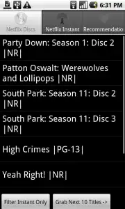

Anyone who has been to this site more than once likely knows of my [Android application for Netflix users](https://blog.edwardawebb.com/site-news/netflix-queue-manager-android-phones "Netflix on Android").  The application supports Android phones like the Motorola Droid, The HTC Incredible, and the Nexus One (among other devices). What none but a few "power users" know is that **I am feverishly working to entirely refactor QueueMan in order to introduce long awaited features**.  The newer version will still be wicked cute, and simple to use, but there are some critical features lacking in the current version I need to address. Like what? Keep reading...

Bug Fixes
---------

A bug?! _In my code_? ... **Impossible**. Er wait, I mean, of course! I wrote the app expecting 30 people would use it.  Since it has been downloaded 30,000 times now I guess I need to make the little guy much more stable .  So My refactoring effort cleans up much of the code in order to mitigate:

*   Failed move or add actions (502 and 200)
*   Failed rating action
*   Confusion around "saved", "available" and "short-wait" titles

Queue Types
-----------

I only use DVD and Instant queues, so QueueMan only cared about those two. Turns out that you, **the public QueueMan adores so much, uses crazy new technology like Blu-Ray**. I won't pretend to understand the new fangled discs, but I will support them.  So Queueman will soon be sporting a second delivery queue for **Blu-Ray** movies. ( **I will need some volunteers who actually have Blu-Ray to test this out for me in the pre-release)** Just drop me a line.

Search Enhancements
-------------------

_Ohhh_ so a simple search focused on titles only doesn't cut it for you?!   Me neither... SO QueueMan will soon be able to **search based on Genre, Actors, Format and more**!

Performance Enhancements
------------------------

The way Queues are handled currently sucks. Its a sharp trade off between seeing all movies, and waiting all day.  To compensate I added the option to choose how many titles you want to see. (5,10,25, 50 and ALL) This makes viewing your first 10 movies much faster, but leaves you cluesless as to #11. **QueueMan wil now support pagination in every queue typ**e (dvd, blu-ray, instant, recommendations and even searches) Whats that mean? Take a look.. \[caption id="attachment_756" align="aligncenter" width="180" caption="Rather than limiting max results, you now specify the results per page., and can grab more titles as needed."\]\[/caption\] **You can now start with ten titles (in a second or two) and then view the next 10, and the next 10, and continue through the result pages until you reach the upper limit.** (The results per page = former Max Results, so you can makes pages any length that suits you!)

Identity Management
-------------------

A number of households share Netflix queues and create "User Profiles" or "Sub-Accounts" to add many queues to one primary account.  The Netflix website allows primary baccount users to fully manage sub-accounts, but their API does not expose such abilities, hence queueman lacks said features. However as a work around, QueueMan will support the ability to maintain multiple accounts, and choose which account to use.

Where The Requests Came From
----------------------------

For a list of outstanding tickets, or to add your own suggestion, please see the Issues section of QueueMan's hosted site. [http://code.google.com/p/queueman/wiki/Issues](http://code.google.com/p/queueman/wiki/Issues "Netflix on Android - Issues")

http://code.google.com/p/queueman/wiki/Issues
