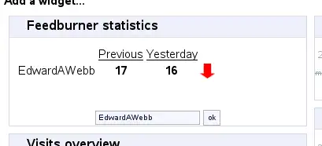

**Feedburner** provides a simple **Ticker** applet for display in your pages and elsewhere. This always worked fine for me until I transferred my feed to Google. Now I love what Google is doing, like free-ifying all of the Pro services, but I really depended on that simple ticker to know where my feed stood. **If you found that the [Feedburner ticker](http://www.feedburner.com/fb/ticker/api-ticker2.jsp?uris= "Add your feed name to the end of the address in the new window.") is no longer working for you (make sure you add your feed's uri to the end), I offer my solution as a replacement.** At least until they update the applet. First I suggest you try the existing  [Feedburner Ticker](http://www.feedburner.com/fb/ticker/api-ticker2.jsp?uris= "Add your feed name to the end of the address in the new window.") before using this. If it shows 0 0, then keep on reading.

Problem
-------

The Feedburner provided Ticker applet no longer provides accurate data for you.  I noticed the issue immediately after transferring my feed to Google.

Solution
--------

**By leveraging the provided [Awareness API](http://code.google.com/apis/feedburner/awareness_api.html "Learn more about Google Feedburners Awareness API"), some xml parsing and a short php snippet we can build a similar widget in no time.** 

THe Steps to Build your Own Feedburner Ticker
---------------------------------------------

#### Prerequesites

First you need to login into your feedburner/google account and be sure you have activated the Awareness API. Its under the Analyze tab. Next you need to find 3 icon images to signify a positive change, negative change, or steady state. You can search Google images perhaps for a nice green up arrow, red down arrow etc.

#### Check the API

So I assume you have already tested that you are able to access the API right? Oh no? Well [try this link](https://feedburner.google.com/api/awareness/1.0/GetFeedData?uri=YOUR_URI_HERE "Be sure to change the uri to reflect your own feed!"), and add your feed uri to the end. You should  a nice XML formatted result like this;

 −
− 

As you can see my sites not so popular today :(

#### The Ticker Code

Since the xml above is rather dry we'll want to spice it up a bit.

link';
			
			//Initialize the Curl session
			$curl = curl_init();
			
			//Set curl to return the data instead of printing it to the browser.
			curl_setopt($curl, CURLOPT_RETURNTRANSFER, 1);
			//Set the URL
			curl_setopt($curl, CURLOPT_URL,  $awApiUrl);
			//Execute the fetch
			$data = curl_exec($curl);
			//Close the connection
			curl_close($curl);
			
			$xml = new SimpleXMLElement($data);
			$prevCount = $xml->feed->entry[0]['circulation'] + 0;
			$yestCount = $xml->feed->entry[1]['circulation'] + 0;
			
			switch(true){
				case ($yestCount == $prevCount):
				$img='';
			break;
				case ($yestCount < $prevCount):
				$img='';
			break;
				case ($yestCount > $prevCount):
				$img='';
			break;
			default:
			echo "hmm.. Can't seem to do math on these figures.  Check this ".$link." to make sure it looks like valid xml";
			
			}
			?>
			
			

			

			

Previous

Yesterday

			

			

			

Alright, now just save that code to your server, lets say http://example.com/feedticker.php and just append your URI... http://example.com/feedticker.php?fb_uri=edwardawebb Yeah its simple but sweet. I found the need to **replace my Piwik Widget which is using the old Feedburner Ticker.** [caption id="attachment_345" align="aligncenter" width="409" caption="Plugin to add Feedburner widget to Piwik"][/caption] If you would like to use this in you **Piwik** install just let me know and I'll shoot the complete **plugin** over to you.  
  

### Updated Feedburner Ticker

I decided that I wanted to track the changes in Reach and Hits in addition to circulation. Ya know something that looked more like this; [caption id="attachment_373" align="aligncenter" width="397" caption="Includes Hits and Reach"][/caption] Yeah, that would be just dandy. If you feel like you want those counts as well than replace the code above with this snippet.

#### feedburnerTicker.php

click';
			
	//Initialize the Curl session
	$curl = curl_init();
			
	//Set curl to return the data instead of printing it to the browser.
	curl_setopt($curl, CURLOPT_RETURNTRANSFER, 1);
	//Set the URL
	curl_setopt($curl, CURLOPT_URL,  $awApiUrl);
	//Execute the fetch
	$data = curl_exec($curl);
	//Close the connection
	curl_close($curl);
			
	$xml = new SimpleXMLElement($data);

	$dataArr=array();
	$i=0;
	foreach($xml->feed->entry as $feedDay){
				
		$dataArr['Circulation'][$i]=$feedDay['circulation'] + 0;
		$dataArr['Hits'][$i]=$feedDay['hits'] + 0;
		$dataArr['Reach'][$i]=$feedDay['reach'] + 0;
		$i++;
	}
		
		?>
			
	$value){
			$img='';
			switch(true){
				case($value[0] == $value[1]):
				$img='';
				break;
				case($value[0] < $value[1]):
				$img='';
				break;
				case($value[0] > $value[1]):
				$img='';
				break;
			}
			echo '';
			echo '';
			echo '';
			echo '';
			echo '';
			echo '';
		}
	?>
			
	

	

		

Previous

Yesterday

	

	

'.$key.'

'.$value[0].'

'.$value[1].'

'.$img.'

Update
------

I have refactored the code about into a html template and php class that can be downloaded as a complete Piwik Plugin. [download_cat#1]
