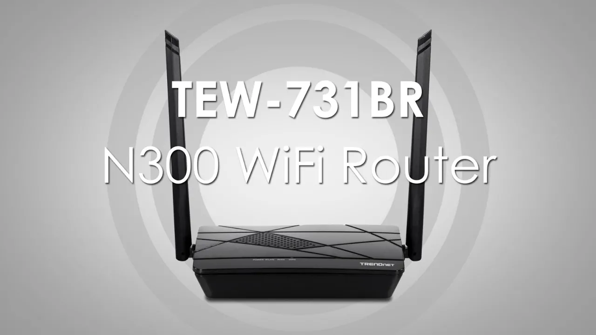

I have a neat little trendnet  that I got on sale a while back with the idle idea I could expand my google mesh already 3 nodes strong.

I tried a few times without much luck.

I Just could not find enough in the documentation to properly configure the repeater without hosting something.

What do I mean hosting? It was like roulette trying to get  a few principles all working in tandem.

### Desired Outcome

- same SSID as existing mesh
- same password
- preserve access to trendnet config / admin interface

Finally got it working and wanted to note the magic dance that let's you work through the multiple router reboots before you lose wireless connectivity.

(Having a computer with a good ol fashion LAN cable would make this all _much_ easier)

### The Setup

#### Reset Router, Set password

You can skip the network config wizard by clicking cancel. None of it is relevant with the repeater config and we don't want to change the SSID yet.   You can set password to match at this point to match your mesh. Since it still has a unique SSID we can still re-connect.

#### Enable Repeater

With wrong SSID still, follow the steps on repeater page to select the nearest AC.  you can find the mac address of nearest router on sticker, etc.

##### SETTING GATEWAY IP

The advice on this step is accurate but confusing.  Since google uses `192.168.86.1` and we want to use `192.168.86.2` for the IP of this router.  

A warning will say "this will break everything and you wont be able to connect", ignore that.  The router will reboot and should successfully connect to existing mesh as `.2` *still using wrong ssid*

#### Confirm gateway admin access

If everything went well we should be able to connect to either SSID at this point and do 3 things.
- internet!
- Google admin on `192.168.86.1`
- Trendnet admin on `192.168.86.2`

#### Merging SSID Names

Use acces on `.2` to change the SSID from the factory assigned to match your mesh.

