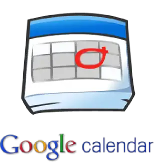
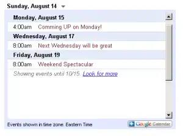
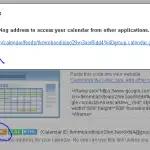

The amount of users who rely on Google Calendars to organize their personal and professional lives is staggering.   Seeing as most clients are comfortable and proficient with the technology, there is little reason to point them elsewhere when they ask for **a custom widget to display upcoming events** on their site. \[caption id="attachment_966" align="aligncenter" width="307" caption="Google Calendars are easy and everywhere, with a robust API we can leverage"\][](http://google.com/calendar)\[/caption\] In fact, the only trouble is that Google's provided widget layouts are all - er, well they are all quite lame, and likely won't match your current theme. No worries!  We can easily leverage Google's calendar API  and Javascript to create a fully customized Calendar widget showing the next N upcoming events in chronological order. Let's start by looking at the provided Google widgets.. \[caption id="attachment_967" align="aligncenter" width="300" caption="Default "Agenda" layout for Google Calendar"\][](default_calendar.webp)\[/caption\] Wow, that would look great in a Google webpage somewhere. But it probably doesn't meet the layout you were looking for.  So we'll use some basic HTML and JS to manipulate an Atom feed from Google. Getting the base URL for your Calendar

### Getting the public URL for a calendar is easy.

1.  Click "settings" for the calendar in question
2.  click the XML icon in the Calendar Address section. [](publicURL.webp)
3.  Copy the URL.

### Adding the necessary parameters to organize the feed

Alright, so we have a URL for an RSS feed.  This RSS format has a few critical downsides.

*   The dates are the date the event was created, not the date it will occur.
*   By default, repeating events are listed as a single event
*   The event name, summary and other details are all trapped in a single <content> element.

But by exploring [Google's API documentation](http://code.google.com/apis/calendar/data/2.0/reference.html "API Reference for Google Calendar") we learn of a better format, their custom Atom feed!

So here is the provided URL from the last section:

https://www.google.com/calendar/feeds/tkmmbaodloipo29vn3aor8idd4%40group.calendar.google.com/public/basic

We need to modify the "basic" projection, and replace it with "full":

https://www.google.com/calendar/feeds/tkmmbaodloipo29vn3aor8idd4@group.calendar.google.com/public/full

But since we don't care about attendees in this case we shrink the payload a little bit:

https://www.google.com/calendar/feeds/tkmmbaodloipo29vn3aor8idd4@group.calendar.google.com/public/full-noattendees

That looks much better!  Now we get custom fields like gd:when and gd:where

 ...
	2011-08-08T14:16:34.000Z
	2011-08-08T14:16:34.000Z
	 Sangria & Tapas Tasting
	 BLAH BLAH BLAH 
	
	
	Calendar Name 

### Parsing the Feed with JS and DOM

Now that all the pieces we need have their own little pockets, we can start parsing into a presentable format.

First we start with a simple block of HTML that will house the populated calendar.

Upcomming Events
----------------

 

 

 

Before we get into the JS I must credit a source I stumbled across while researching this. The objective is quite common, so it may not be the original source. http://blog.csdn.net/runupwind/article/details/1655837

### The JavaScript that parses the DOM and prints HTML

Just edit the backend URL here, unless you want to completely change the layout of things. You should be able to CSS alone to get the style you want. **Same Origin Policy applies, so you will need to call a backend script on the same domain that relays to Google.com**
```js 
<!--
// the max number of evewnts to show
maxEvents = 7;

var RSSRequestObject = false; // XMLHttpRequest Object
var Backend = '/wp-content/uploads/2011/08/demo/backend.php'; // Backend call to same domain proxy (prevents 'is not allowed by Access-Control-Allow-Origin.')
window.setInterval("update_timer()", 1200000); // update the data every 20 mins

 // DO NOT EDIT BELOW
 
if (window.XMLHttpRequest) // try to create XMLHttpRequest
	RSSRequestObject = new XMLHttpRequest();
 
if (window.ActiveXObject)	// if ActiveXObject use the Microsoft.XMLHTTP
	RSSRequestObject = new ActiveXObject("Microsoft.XMLHTTP");
 
 
/*
* onreadystatechange function
*/
function ReqChange() {
 
	// If data received correctly
	if (RSSRequestObject.readyState==4) {
	
		// if data is valid
		if (RSSRequestObject.responseText.indexOf('invalid') == -1) 
		{ 	
			// Parsing Feeds
			var node = RSSRequestObject.responseXML.documentElement; 
			
			// Get the calendar title
			var title = node.getElementsByTagName('title').item(0).firstChild.data;
			
			content = '<div class="channeltitle">'+title+'</div>';
		
			// Browse events
			var items = node.getElementsByTagName('entry');
			if (items.length == 0) {
				content += '<ul><li><div class=error>No events</div></li></ul>';
			} else {
				content += '<ul>';
if(maxEvents > items.length) maxEvents = items.length;
				for (var n=0; n <= maxEvents-1; n++)
				{
					var itemTitle = items\[n\].getElementsByTagName('title').item(0).firstChild.data;
					
					// may have empty content if no event details were added
					try{
						var Summary = items\[n\].getElementsByTagName('content').item(0).firstChild.data;
					}catch(e){
						var Summary = '';
					}


var eventId="";
var baseUrl=items\[n\].getElementsByTagName('link').item(0).attributes.getNamedItem("href").value;
//alert(calId);

					var itemLink = baseUrl;
console.log(items\[n\].getElementsByTagName('when'));
var roughStartDate=items\[n\].getElementsByTagName('when').item(0).attributes.getNamedItem("startTime").value;


					try 
					{  var mydate=new Date(roughStartDate);
var readAs="" + (mydate.getMonth()+1) + "/" + mydate.getDate() + "/" + mydate.getFullYear();
						var itemPubDate = '<span class="event-date">\['+ readAs+'\]</span> ';
					} 
					catch (e) 
					{ 
						var itemPubDate = '';
					}
					
				
					content += '<li>'+itemPubDate+'<a href="'+itemLink+'"><span class="event-summary">'+itemTitle+'</span></a></li>';
				}
				
	
				content += '</ul>';
			}
			// Display the result
			document.getElementById("calendarFeed").innerHTML = content;
 
			// Tell the reader the everything is done
			document.getElementById("status").innerHTML = "Done.";
			
		}
		else {
			// Tell the reader that there was error requesting data
			document.getElementById("status").innerHTML = "<div class=error>Error requesting data.<div>";
		}
		
		HideShow('status');
	}
	
}
 
/*
* Main AJAX RSS reader request
*/
function RSSRequest() {
 
	// change the status to requesting data
	HideShow('status');
	document.getElementById("status").innerHTML = "Requesting data ...";
	
	// Prepare the request
	RSSRequestObject.open("GET", Backend , true);
	// Set the onreadystatechange function
	RSSRequestObject.onreadystatechange = ReqChange;
	// Send
	RSSRequestObject.send(null); 
}
 
/*
* Timer
*/
function update_timer() {
	RSSRequest();
}
 
 
function HideShow(id){
	var el = GetObject(id);
	if(el.style.display=="none")
	el.style.display='';
	else
	el.style.display='none';
}
 
function GetObject(id){
	var el = document.getElementById(id);
	return(el);
}
 RSSRequest();
//-->
```

### Same-Origin who what?

Refer to wikipedia for the "[what is same origin policy](http://en.wikipedia.org/wiki/Same_origin_policy "same origin policy")" But to us it means that we can't pull data from google and operate on it unless we call a script on the same host as our domain first. This script (PHP, ASP, python, whatever) has to pass the data to our front-end javascript. My demo uses PHP, which is easy and readily available. But by no means the only approach.

### Demo - First Attempt

Alright, so we have a decent XML feed with the info we need. We have a JS snippet to walk the DOM and pull out our info. And we are inserting the formatted HTML into our page. Let's have a look! Iframe containing Demo 1 - <a href="https://blog.edwardawebb.com/wp-content/uploads/2011/08/demo/demo1.html">Demo 1</a> **Yes, quite ugly without any styling, but there is a bigger issue, the dates are all wrong**. No order, past and future.. no Good!

### Customize the output

In order to get the future looking, chronological calendar we expect, we'll need to tell Google Calendar to refine the results a bit.. Again, consulting the [Google's API documentation](http://code.google.com/apis/calendar/data/2.0/reference.html "API Reference for Google Calendar") we learn of 4 critical modifiers:

*   futureevents=true
*   singleevents=true
*   orderby=starttime
*   sortorder=ascending

This will tell Google Calendar we only want future events, sorted by the start time, ascending. We also ask that recurring events be specified individually, and not as one event.

https://www.google.com/calendar/feeds/tkmmbaodloipo29vn3aor8idd4%40group.calendar.google.com/public/full-noattendees?futureevents=true&singleevents=true&orderby=starttime&sortorder=ascending

### Demo 2

Iframe containing Demo 2 - <a href="https://blog.edwardawebb.com/wp-content/uploads/2011/08/demo/demo2.html">Demo 2</a>

That looks much better!

### Styling it up

The choir is just to add the appropriate CSS styling to format the feed as you wish. I'm no designer, and your site is much different then mine. SO I issue a challenge to some of my CSS savvy readers. **Submit your best styling for this widget and I will include the winner's css for everyone to awe over C'mon! I wanna see rounded corners, pretty gradients, clear divisions and nice eye candy.  **
